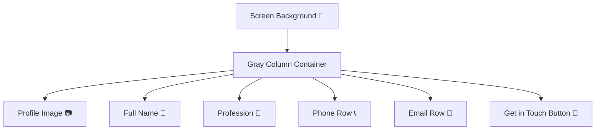
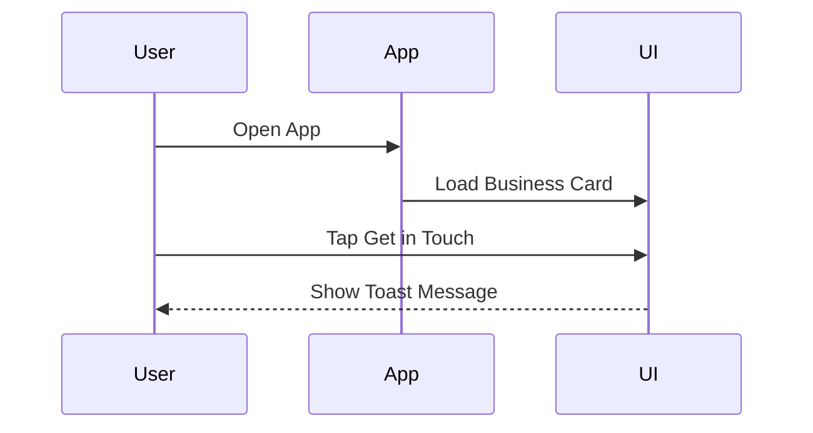

# 💼 Digital Business Card App (Jetpack Compose)

A modern Android application built with **Kotlin** and **Jetpack Compose** that replaces a traditional paper business card with an elegant **digital business card**.

This project demonstrates **Jetpack Compose layouts, buttons, images, rows, columns, styling, and Toast messages** while building a clean professional UI.

---

## 🚀 Features

📷 Display profile photo
👤 Show full name
💼 Profession / Job title
📞 Contact details (phone, email, etc.)
🎨 Gray background card layout
📱 Fully built using **Jetpack Compose**
🔘 Custom "Get in Touch" button
✨ Rounded corners + custom colors
📢 Toast message on button click

---

## 🧩 UI Components Used

| Item          | Component    |
| ------------- | ------------ |
| Profile Photo | `Image`      |
| Full Name     | `Text`       |
| Profession    | `Text`       |
| Contact Info  | `Row + Text` |
| Main Layout   | `Column`     |
| Action Button | `Button`     |

---

## 🎨 Layout Structure

All components are arranged vertically using a **Column**.



---

## 📱 Example UI Preview
[photo]

---

## 📌 Functional Requirements

### 📷 Profile Section

* Show profile image using `Image`
* Circular or rounded style recommended

### 👤 Identity Section

* Full name using bold `Text`
* Profession / title below the name

### 📞 Contact Section

Each contact line uses a **Row** with two `Text` elements:

```plaintext
Phone:   +90 555 123 4567
Email:   yourname@email.com
```

### 🔘 Get in Touch Button

* Displays **Toast message**
* Custom button color using `ButtonDefaults`
* Rounded corners using `RoundedCornerShape`

---

## 🛠️ Tech Stack

* **Language:** Kotlin 🧩
* **UI Toolkit:** Jetpack Compose 🎨
* **IDE:** Android Studio 🤖
* **Design:** Material 3 ✨

---

## 📁 Project Structure

```plaintext
com.example.businesscardapp
│
├── MainActivity.kt
├── ui/theme/
│
├── res/drawable/
│   └── profile.jpg
```

---

## 🔄 App Workflow



---

## 🎯 Learning Outcomes

This project helps you learn:

* Jetpack Compose `Column`
* Jetpack Compose `Row`
* `Text`, `Image`, `Button`
* Styling components
* Custom button shapes
* Toast messages in Compose
* UI alignment & spacing

---

## 📌 Future Improvements

* 🌙 Dark mode support
* 🌐 Clickable social media links
* 📷 Camera profile upload
* 🎞️ Animations with Compose
* 💾 Save contact as vCard

---

