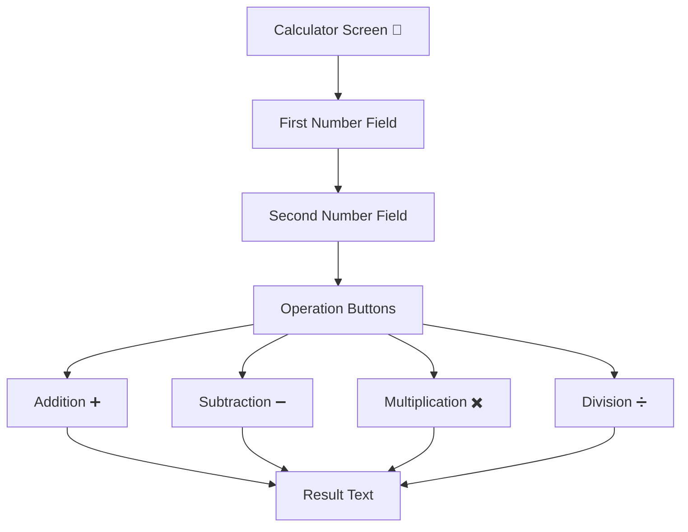
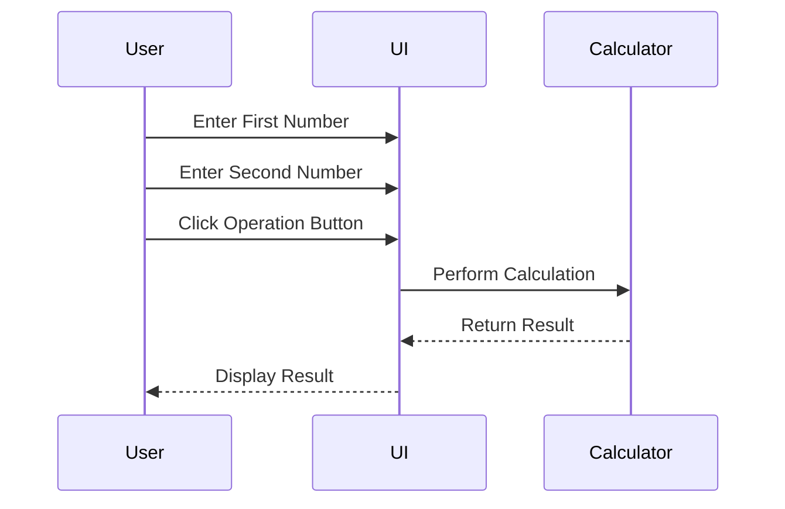

# 🧮 Simple Calculator App (Jetpack Compose)

A basic Android calculator application built using **Kotlin** and **Jetpack Compose**.
The app allows users to enter two numbers and perform simple arithmetic operations such as:

➕ Addition
➖ Subtraction
✖️ Multiplication
➗ Division

The result is displayed instantly on the screen.

---

## 📚 Assignment Translation

### 📌 Objective

Develop a simple calculator Android application with an interface similar to the given design.

The user will:

1. Enter two numbers into two text fields.
2. Click one of the operation buttons:

   * Addition (+)
   * Subtraction (-)
   * Multiplication (*)
   * Division (/)
3. View the calculation result inside the **Result** text area.

The application must be developed using **Android Jetpack Compose**.

---

## 🚀 Features

✅ Input two numbers
✅ Perform 4 arithmetic operations
✅ Display result dynamically
✅ Built entirely with Jetpack Compose
✅ Modern declarative UI
✅ Responsive vertical layout using Column

---

## 🧩 Components Used

| Feature          | Compose Component             |
| ---------------- | ----------------------------- |
| Number Input     | `OutlinedTextField`           |
| Buttons          | `Button`                      |
| Result Display   | `Text`                        |
| Layout           | `Column` + `Row`              |
| State Management | `remember` + `mutableStateOf` |

---

## 🎨 UI Layout Structure



---

## 📱 Example UI Preview

---

## 📁 Project Structure

```plaintext id="pd74jc"
com.example.calculatorapp
│
├── MainActivity.kt
│
├── ui/theme/
```

---

## 🔄 Application Workflow



---

## 🛠️ Tech Stack

* **Language:** Kotlin 🧩
* **UI Toolkit:** Jetpack Compose 🎨
* **IDE:** Android Studio 🤖
* **Design Pattern:** Declarative UI ✨

---

## 🎯 Learning Outcomes

This project helps you understand:

* Jetpack Compose basics
* State management in Compose
* Handling button clicks
* User input with TextFields
* Updating UI dynamically
* Arithmetic operations in Kotlin

---

## 📌 Future Improvements

* 🌙 Dark mode support
* 🧮 Scientific calculator functions
* 📜 Calculation history
* 🎨 Better Material 3 UI
* 🔢 Input validation

---


