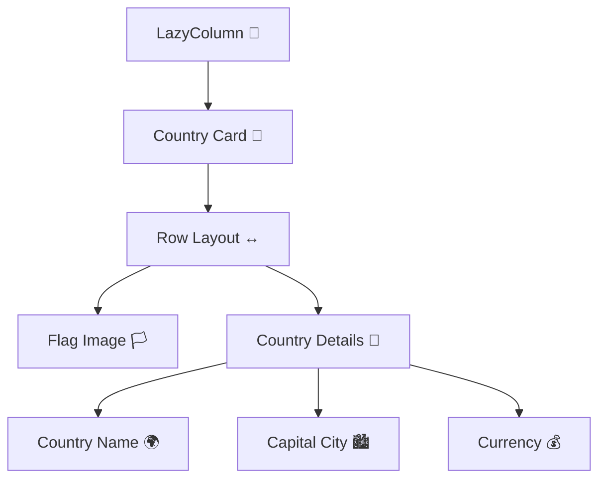
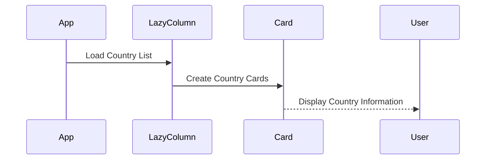

# 🌍 Country List App (Jetpack Compose + LazyColumn)

A modern Android application built using **Kotlin** and **Jetpack Compose** that displays a list of countries using a high-performance `LazyColumn`.

The app demonstrates modern Android UI development concepts such as:

✅ LazyColumn
✅ Card Components
✅ Row & Column Layouts
✅ Drawable Resources
✅ Image Handling
✅ Modern Material 3 Design

---

# 📚 Assignment Overview

### 📌 Objective

Develop an Android application using **Jetpack Compose** that displays information about 10 countries around the world.

Each country item must include:

* 🏳️ Country Flag
* 🌍 Country Name
* 🏙️ Capital City
* 💰 Currency

The application must use a **LazyColumn** for efficient list rendering.

---

# 🚀 Features

✅ High-performance scrolling with `LazyColumn`
✅ Beautiful country cards using `Card`
✅ Flag images loaded from `drawable`
✅ Modern Compose UI
✅ Row & Column layout hierarchy
✅ Clean Material 3 design

---

# 🧩 Components Used

| Feature           | Compose Component |
| ----------------- | ----------------- |
| Scrollable List   | `LazyColumn`      |
| Country Container | `Card`            |
| Horizontal Layout | `Row`             |
| Vertical Layout   | `Column`          |
| Flag Display      | `Image`           |
| Text Information  | `Text`            |

---

# 🎨 UI Layout Structure



---

# 📱 Example UI Preview


---

# 📁 Project Structure

```plaintext id="4p9m1n"
com.example.countrylistapp
│
├── MainActivity.kt
├── Country.kt
│
├── res/drawable/
│   ├── turkey.png
│   ├── usa.png
│   ├── japan.png
│   ├── germany.png
│   └── ...
│
├── ui/theme/
```

---

# 📦 Data Structure

The country list is created using:

```kotlin id="6px6wp"
listOf()
```

Each country object contains:

```plaintext id="mvlh80"
- Flag Image
- Country Name
- Capital City
- Currency
```

---

# 🔄 Application Workflow



---

# 🛠️ Tech Stack

* **Language:** Kotlin 🧩
* **UI Toolkit:** Jetpack Compose 🎨
* **Design:** Material 3 ✨
* **IDE:** Android Studio 🤖

---

# 🎯 Learning Outcomes

This project helps you understand:

* LazyColumn usage
* Efficient list rendering
* Card design in Compose
* Row & Column layouts
* Resource management
* Image loading from drawable
* Building modern Android UIs

---

# 📌 Expected Output

Each country row contains:

✅ Country flag image
✅ Country name
✅ Capital city
✅ Currency information

---

# 🌍 Example Countries

```plaintext id="0d0l7x"
Turkey
United States
Japan
Germany
France
Canada
Brazil
India
Italy
Australia
```

---

# 📌 Future Improvements

* 🔍 Search functionality
* 🌙 Dark mode support
* 🌐 Detailed country screen
* ❤️ Favorite countries feature
* ☁️ API integration for live country data

---

# ⭐ Support

If you found this project useful, consider giving it a ⭐ on GitHub!

---

# 🔥 Next Step Available

I can also provide:

✅ Full working Jetpack Compose code
✅ Modern Material 3 UI
✅ Animated Cards
✅ Search Feature
✅ API-based country app
✅ RecyclerView XML version

Just say **give full code** 👍
