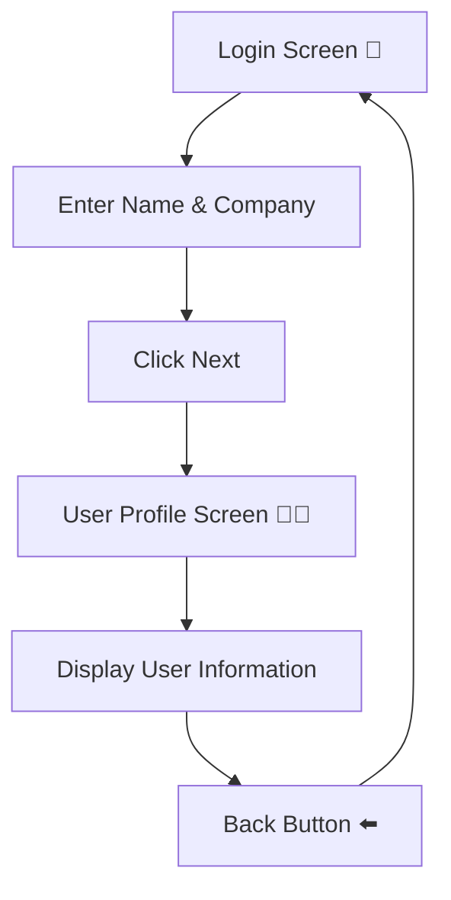

# 🔐 Full Working Kotlin Code — Login & User Profile App (Jetpack Compose)

This app includes:

✅ Login Screen
✅ UserProfile Screen
✅ Navigation Compose
✅ Data Passing Between Screens
✅ Back Navigation
✅ Material 3 UI
✅ Jetpack Compose State Management

---

# 📁 Project Structure

```plaintext id="d5k7tw"
com.example.loginprofileapp
│
├── MainActivity.kt
├── LoginScreen.kt
├── UserProfileScreen.kt
│
├── ui/theme/
```

---

# 🧩 1. Add Dependency (Gradle)

## `build.gradle.kts (Module: app)`

```kotlin id="l8r0as"
dependencies {

    implementation("androidx.navigation:navigation-compose:2.7.7")

}
```

---

# 🚀 MainActivity.kt

```kotlin id="r5h2ka"
package com.example.loginprofileapp

import android.os.Bundle
import androidx.activity.ComponentActivity
import androidx.activity.compose.setContent
import androidx.navigation.compose.NavHost
import androidx.navigation.compose.composable
import androidx.navigation.compose.rememberNavController

class MainActivity : ComponentActivity() {

    override fun onCreate(savedInstanceState: Bundle?) {
        super.onCreate(savedInstanceState)

        setContent {

            val navController = rememberNavController()

            NavHost(
                navController = navController,
                startDestination = "login"
            ) {

                composable("login") {

                    LoginScreen(navController)
                }

                composable( "profile/{name}/{company}" )
                 { backStackEntry ->
             val name = backStackEntry.arguments?.getString("name") ?: ""
             val company = backStackEntry.arguments?.getString("company") ?: ""

                    UserProfileScreen(navController,name,company )
                }
            }
        }
    }
}
```

---

# 🔐 LoginScreen.kt

```kotlin id="h7m4zc"
package com.example.loginprofileapp

import androidx.compose.foundation.layout.*
import androidx.compose.material3.*
import androidx.compose.runtime.*
import androidx.compose.ui.Alignment
import androidx.compose.ui.Modifier
import androidx.compose.ui.text.font.FontWeight
import androidx.compose.ui.unit.dp
import androidx.compose.ui.unit.sp
import androidx.navigation.NavController

@Composable
fun LoginScreen(navController: NavController) {

    var name by remember { mutableStateOf("") }
    var company by remember { mutableStateOf("") }

    Column(
        modifier = Modifier
            .fillMaxSize()
            .padding(24.dp),

        horizontalAlignment = Alignment.CenterHorizontally,
        verticalArrangement = Arrangement.Center
    ) {

        Text(
            text = "Login Screen",
            fontSize = 28.sp,
            fontWeight = FontWeight.Bold
        )

        Spacer(modifier = Modifier.height(24.dp))

        // Name Field
        OutlinedTextField(
            value = name,
            onValueChange = { name = it },

            label = {
                Text("Enter Name")
            },

            modifier = Modifier.fillMaxWidth()
        )

        Spacer(modifier = Modifier.height(16.dp))

        // Company Field
        OutlinedTextField(
            value = company,
            onValueChange = { company = it },

            label = {
                Text("Enter Company")
            },

            modifier = Modifier.fillMaxWidth()
        )

        Spacer(modifier = Modifier.height(24.dp))

        // Next Button
        Button(
            onClick = {

                navController.navigate( "profile/$name/$company")
            },

            modifier = Modifier.fillMaxWidth()
        ) {

            Text(
                text = "Next",
                fontSize = 18.sp
            )
        }
    }
}
```

---

# 👨‍💼 UserProfileScreen.kt

```kotlin id="m1q8ep"
package com.example.loginprofileapp

import androidx.compose.foundation.layout.*
import androidx.compose.material3.*
import androidx.compose.runtime.Composable
import androidx.compose.ui.Alignment
import androidx.compose.ui.Modifier
import androidx.compose.ui.text.font.FontWeight
import androidx.compose.ui.unit.dp
import androidx.compose.ui.unit.sp
import androidx.navigation.NavController

@Composable
fun UserProfileScreen( navController: NavController,name: String,company: String) {

    Column(
        modifier = Modifier
            .fillMaxSize()
            .padding(24.dp),

        horizontalAlignment = Alignment.CenterHorizontally,
        verticalArrangement = Arrangement.Center
    ) {

        Text(
            text = "User Profile",
            fontSize = 30.sp,
            fontWeight = FontWeight.Bold
        )

        Spacer(modifier = Modifier.height(30.dp))

        Text(
            text = "Name: $name",
            fontSize = 22.sp
        )

        Spacer(modifier = Modifier.height(16.dp))

        Text(
            text = "Company: $company",
            fontSize = 22.sp
        )

        Spacer(modifier = Modifier.height(40.dp))

        // Back Button
        Button(
            onClick = {

                navController.popBackStack()
            },

            modifier = Modifier.fillMaxWidth()
        ) {

            Text(
                text = "Back",
                fontSize = 18.sp
            )
        }
    }
}
```

---

# 📱 UI Preview


---

# 🔄 Navigation Flow



---

# 🎯 Example Output

## Login Screen

```plaintext id="r3j7tn"
Name: ZAW NAING
Company: OpenAI
```

## UserProfile Screen

```plaintext id="s5c9mq"
Name: ZAW NAING
Company: OpenAI
```

---

# ⭐ Next Upgrade Available


✅ Animated Navigation
✅ Beautiful Material 3 UI
✅ Login Validation
✅ Profile Image Upload
✅ Dark Mode
✅ Firebase Authentication
✅ MVVM Architecture Version

