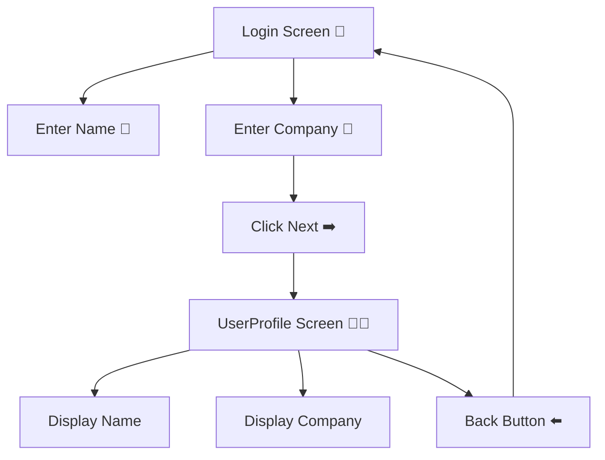
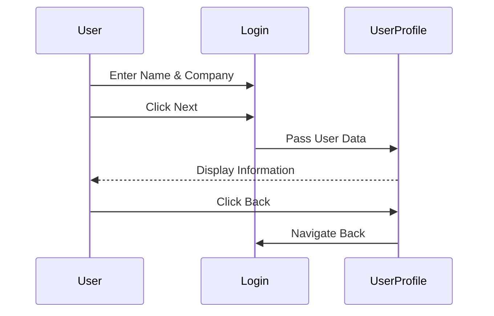

# 🔐 Login & User Profile App (Jetpack Compose)

A modern Android application built using **Kotlin** and **Jetpack Compose** that demonstrates **navigation between composable screens** and **data transfer between screens**.

The app starts with a **Login Screen** where the user enters:

* 👤 Name
* 🏢 Company Name

After clicking the **Next** button, the app navigates to the **UserProfile Screen**, where the entered information is displayed.

The user can return back to the Login screen using the **Back** button.

---

# 📚 Assignment Overview

### 📌 Objective

Develop an Android application using **Jetpack Compose** that contains:

✅ Login Screen (`Login` composable)
✅ User Profile Screen (`UserProfile` composable)
✅ Navigation between screens
✅ Data transfer between composables
✅ Back navigation functionality

---

# 🚀 Features

✅ Two-screen navigation
✅ User input with TextFields
✅ State management with Compose
✅ Data passing between composables
✅ Back button functionality
✅ Modern Material 3 UI

---

# 🧩 Components Used

| Feature          | Compose Component             |
| ---------------- | ----------------------------- |
| Text Input       | `OutlinedTextField`           |
| Buttons          | `Button`                      |
| Screen Layout    | `Column`                      |
| Navigation       | `NavController`               |
| State Management | `remember` + `mutableStateOf` |

---

# 🎨 UI Layout Structure



---

# 📱 Example UI Preview


---

# 📁 Project Structure

```plaintext id="d1c7wq"
com.example.loginprofileapp
│
├── MainActivity.kt
├── LoginScreen.kt
├── UserProfile.kt
│
├── ui/theme/
```

---

# 🔄 Application Workflow



---

# 🛠️ Tech Stack

* **Language:** Kotlin 🧩
* **UI Toolkit:** Jetpack Compose 🎨
* **Navigation:** Navigation Compose 🧭
* **IDE:** Android Studio 🤖
* **Design:** Material 3 ✨

---

# 🎯 Learning Outcomes

This project helps you understand:

* Navigation in Jetpack Compose
* Passing data between composables
* State management
* Text input handling
* Screen transitions
* Back navigation handling

---

# 📌 Functional Requirements

## 🔐 Login Screen

* Enter Name
* Enter Company Name
* Click Next button

---

## 👨‍💼 UserProfile Screen

* Show entered Name
* Show Company Name
* Navigate back to Login screen

---

# 📌 Future Improvements

* 🔑 Authentication system
* 🌙 Dark mode support
* 🖼️ Profile image upload
* 💾 Save user session
* ☁️ Firebase login integration

---
