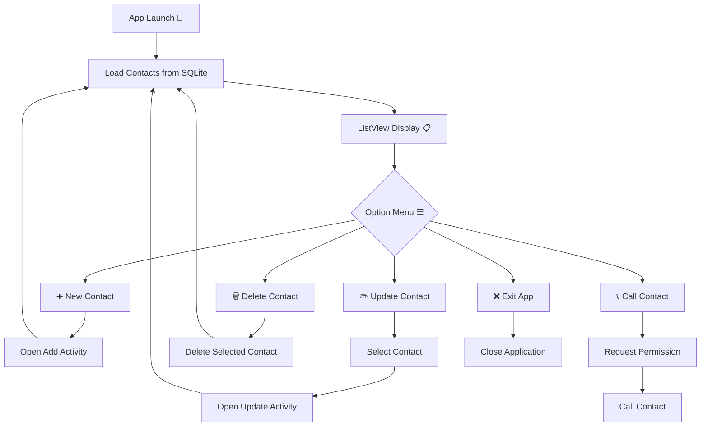

# 📱 SQLite Contact Manager App

A simple yet powerful Android application built using **Kotlin** and **SQLite**, designed to manage contacts efficiently. This project demonstrates core Android development concepts such as **CRUD operations, Intents, Permissions, ListView, and SQLite database integration**.

---

## 🚀 Features

✨ **Add New Contact**
✨ **View Contacts in ListView**
✨ **Update Existing Contact**
✨ **Delete Contact**
✨ **Call Contact (with permission handling)**
✨ **Exit Application via Menu**

---

## 🗂️ Database Structure

The application uses an SQLite database with the following schema:

| Field Name   | Type    | Description                  |
| ------------ | ------- | ---------------------------- |
| ID           | INTEGER | Auto-incremented primary key |
| Name-Surname | TEXT    | Full name of the person      |
| Phone Number | TEXT    | Contact number               |

---

## 🧩 Application Workflow



---

## 📌 Functional Requirements

### ➕ New Contact

* Opens a new activity
* User can input:

  * Name-Surname
  * Phone Number
* Data is stored in SQLite database

---

### ✏️ Update Contact

* User selects a contact from **ListView**
* Opens update activity
* Allows modification of:

  * Name-Surname
  * Phone Number
* Updates record in database

---

### 🗑️ Delete Contact

* Deletes selected contact from the database
* List updates automatically

---

### 📞 Call Contact

* Requests runtime permission (**CALL_PHONE**)
* Initiates call to selected contact

---

### ❌ Exit

* Closes the application safely

---

## 🛠️ Tech Stack

* **Language:** Kotlin 🧑‍💻
* **Database:** SQLite 🗄️
* **UI:** XML + ListView 🎨
* **Concepts Used:**

  * Intents
  * Runtime Permissions
  * SQLiteOpenHelper
  * CRUD Operations

---

## 📷 Screens (Optional)

> *(Add screenshots here if you want 👇)*

```
Main Screen | Add Contact | Update Contact
```

---

## 🎯 Learning Outcomes

This project helps you understand:

* How to integrate **SQLite database** in Android
* Performing **CRUD operations**
* Managing **activities and intents**
* Handling **user permissions**
* Building a complete **real-world mini application**

---
