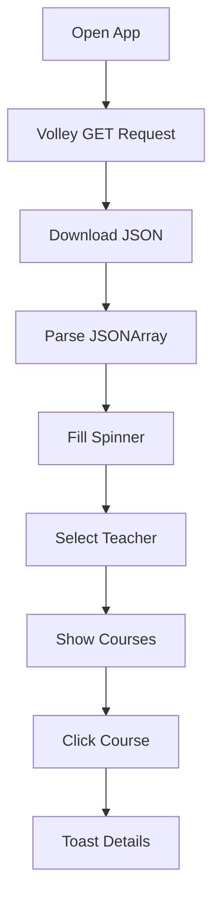

# 📡 Full Working Kotlin Code — JSON Parsing App (Volley + Spinner + ListView)

This Android app:

✅ Fetches JSON from URL using **Volley**
✅ Parses JSON data
✅ Displays teachers in **Spinner**
✅ Shows selected teacher's courses in **ListView**
✅ Clicking course shows **Toast** with details

---

# 📁 Project Structure

```plaintext
com.example.jsonapp
│
├── MainActivity.kt
├── Teacher.kt
├── Course.kt
│
├── res/layout/
│   └── activity_main.xml
│
├── AndroidManifest.xml
```

---

# 🧩 1. Add Dependency (Gradle)

## `build.gradle.kts (Module: app)`

```kotlin
dependencies {
    implementation("com.android.volley:volley:1.2.1")
}
```

---

# 🌐 2. AndroidManifest.xml

```xml
<manifest xmlns:android="http://schemas.android.com/apk/res/android">

    <uses-permission android:name="android.permission.INTERNET"/>

    <application
        android:allowBackup="true"
        android:theme="@style/Theme.AppCompat.Light.DarkActionBar">

        <activity android:name=".MainActivity">
            <intent-filter>
                <action android:name="android.intent.action.MAIN"/>
                <category android:name="android.intent.category.LAUNCHER"/>
            </intent-filter>
        </activity>

    </application>
</manifest>
```

---

# 📦 3. Data Classes

## Teacher.kt

```kotlin
package com.example.jsonapp

data class Teacher(
    val name: String,
    val courses: ArrayList<Course>
)
```

## Course.kt

```kotlin
package com.example.jsonapp

data class Course(
    val code: String,
    val name: String,
    val credit: String
)
```

---

# 🎨 4. activity_main.xml

```xml
<?xml version="1.0" encoding="utf-8"?>
<LinearLayout xmlns:android="http://schemas.android.com/apk/res/android"
    android:orientation="vertical"
    android:padding="16dp"
    android:layout_width="match_parent"
    android:layout_height="match_parent">

    <Spinner
        android:id="@+id/spinnerTeachers"
        android:layout_width="match_parent"
        android:layout_height="wrap_content"/>

    <ListView
        android:id="@+id/listViewCourses"
        android:layout_width="match_parent"
        android:layout_height="match_parent"
        android:layout_marginTop="12dp"/>

</LinearLayout>
```

---

# 🚀 5. MainActivity.kt

```kotlin
package com.example.jsonapp

import android.os.Bundle
import android.widget.*
import androidx.appcompat.app.AppCompatActivity
import com.android.volley.Request
import com.android.volley.toolbox.StringRequest
import com.android.volley.toolbox.Volley
import org.json.JSONArray
import org.json.JSONObject

class MainActivity : AppCompatActivity() {

    lateinit var spinner: Spinner
    lateinit var listView: ListView

    val teacherList = ArrayList<Teacher>()
    val teacherNames = ArrayList<String>()
    val courseNames = ArrayList<String>()
    val selectedCourses = ArrayList<Course>()

    override fun onCreate(savedInstanceState: Bundle?) {
        super.onCreate(savedInstanceState)
        setContentView(R.layout.activity_main)

        spinner = findViewById(R.id.spinnerTeachers)
        listView = findViewById(R.id.listViewCourses)

        fetchJsonData()
    }

    private fun fetchJsonData() {

        val url =
            "https://raw.githubusercontent.com/yasinor/Mobil_Ders/refs/heads/main/school.json"

        val queue = Volley.newRequestQueue(this)

        val request = StringRequest(
            Request.Method.GET, url,

            { response ->
                parseJson(response)
            },

            {
                Toast.makeText(this, "Error loading data", Toast.LENGTH_SHORT).show()
            }
        )

        queue.add(request)
    }

    private fun parseJson(response: String) {

        val jsonArray = JSONArray(response)

        for (i in 0 until jsonArray.length()) {

            val teacherObj = jsonArray.getJSONObject(i)

            val teacherName = teacherObj.getString("teacher")

            val courseArray = teacherObj.getJSONArray("courses")

            val courses = ArrayList<Course>()

            for (j in 0 until courseArray.length()) {

                val courseObj = courseArray.getJSONObject(j)

                val code = courseObj.getString("code")
                val name = courseObj.getString("name")
                val credit = courseObj.getString("credit")

                courses.add(Course(code, name, credit))
            }

            teacherList.add(Teacher(teacherName, courses))
            teacherNames.add(teacherName)
        }

        loadSpinner()
    }

    private fun loadSpinner() {

        val adapter = ArrayAdapter(
            this,
            android.R.layout.simple_spinner_dropdown_item,
            teacherNames
        )

        spinner.adapter = adapter

        spinner.onItemSelectedListener =
            object : AdapterView.OnItemSelectedListener {

                override fun onItemSelected(
                    parent: AdapterView<*>?,
                    view: android.view.View?,
                    position: Int,
                    id: Long
                ) {
                    showCourses(position)
                }

                override fun onNothingSelected(parent: AdapterView<*>?) {}
            }
    }

    private fun showCourses(position: Int) {

        courseNames.clear()
        selectedCourses.clear()

        val courses = teacherList[position].courses

        for (course in courses) {
            courseNames.add(course.name)
            selectedCourses.add(course)
        }

        val adapter = ArrayAdapter(
            this,
            android.R.layout.simple_list_item_1,
            courseNames
        )

        listView.adapter = adapter

        listView.setOnItemClickListener { _, _, pos, _ ->

            val c = selectedCourses[pos]

            Toast.makeText(
                this,
                "Code: ${c.code}\nName: ${c.name}\nCredit: ${c.credit}",
                Toast.LENGTH_LONG
            ).show()
        }
    }
}
```

---

# 📌 How It Works



---

# ✅ Output

## Spinner:

```plaintext
Ahmet Yılmaz
Mehmet Kaya
Ayşe Demir
```

## ListView after select:

```plaintext
Mobile Programming
Database Systems
Android Studio
```

## Toast:

```plaintext
Code: CSE201
Name: Mobile Programming
Credit: 4
```

---

# 🔥 If JSON Format Different?

Send me the real JSON file and I’ll customize instantly.

---

# ⭐ Next Upgrade Options

I can also improve this to:

### 🔥 Modern Version

✅ RecyclerView
✅ CardView UI
✅ Retrofit
✅ Glide
✅ Search Filter
✅ MVVM Architecture

Just say **"upgrade this project"** 👍
