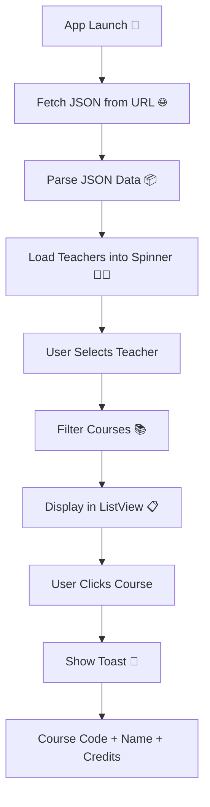
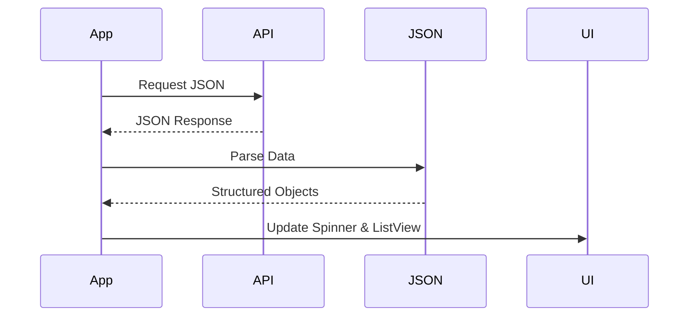

# 📡 JSON Data Parsing & Display App (Android)

An Android application built with **Kotlin** that fetches JSON data from a remote server, parses it, and dynamically displays the content using **Spinner** and **ListView** components.

This project demonstrates real-world concepts like **network requests, JSON parsing, UI interaction, and dynamic data binding**.

---

## 🚀 Features

🌐 Fetch JSON data from a remote URL
🔄 Parse structured JSON data
👨‍🏫 Display teachers in a **Spinner**
📚 Show courses in a **ListView** based on selection
📢 Show course details via **Toast message**
⚡ Smooth UI interaction and dynamic updates

---

## 🔗 Data Source

You can use either of the following APIs:

* 📄 http://vrarch.org/mobil_ders/school.json
* 📄 https://raw.githubusercontent.com/yasinor/Mobil_Ders/refs/heads/main/school.json

---

## 🧩 Application Workflow



---

## 📊 JSON Structure (Example)

```json
{
  "Teachers": [
    {
      "name": "Mehmet Akbaba",
      "id": 1
    },
    {
      "name": "Umit Atila",
      "id": 2
    },
    {
      "name": "Yasin Ortakci",
      "id": 3
    },
    {
      "name": "Oguz Findik",
      "id": 4
    }
  ],
  "Courses": [
    {
      "code": "BLM200",
      "name": "Electronics",
      "teacherId": 1,
      "credit": 4
    },
    {
      "code": "BLM100",
      "name": "Programming",
      "teacherId": 2,
      "credit": 6
    },
    {
      "code": "BLM300",
      "name": "Operating Systems",
      "teacherId": 3,
      "credit": 4
    },
    {
      "code": "BLM211",
      "name": "Logic",
      "teacherId": 1,
      "credit": 4
    },
    {
      "code": "BLM207",
      "name": "Data Structures",
      "teacherId": 4,
      "credit": 4
    },
    {
      "code": "BLM101",
      "name": "Mathematics",
      "teacherId": 3,
      "credit": 5
    },
    {
      "code": "BLM312",
      "name": "Formal Languages",
      "teacherId": 4,
      "credit": 3
    },
    {
      "code": "BLM410",
      "name": "Artificial Intelligence",
      "teacherId": 2,
      "credit": 3
    },
    {
      "code": "BLM311",
      "name": "Microprocessors",
      "teacherId": 1,
      "credit": 4
    },
    {
      "code": "BLM408",
      "name": "Parallel Programming",
      "teacherId": 4,
      "credit": 3
    },
    {
      "code": "BLM305",
      "name": "Numerical Analysis",
      "teacherId": 3,
      "credit": 4
    },
    {
      "code": "BLM203",
      "name": "Database",
      "teacherId": 2,
      "credit": 5
    }
  ]
}
```

---

## 📱 UI Components

| Component | Purpose             |
| --------- | ------------------- |
| Spinner   | Select teacher      |
| ListView  | Display courses     |
| Toast     | Show course details |

---

## 📌 Functional Requirements

### 👨‍🏫 Teacher Selection

* Load teacher names into Spinner
* Dynamically populated from JSON

---

### 📚 Course Listing

* When a teacher is selected:

  * Filter courses belonging to that teacher
  * Display them in ListView

---

### 📢 Course Details

* On clicking a course:

  * Show a Toast message with:

    * Course Code
    * Course Name
    * Credit

---

## 🛠️ Tech Stack

* **Language:** Kotlin 🧑‍💻
* **Networking:** Volley / URL Connection 🌐
* **Data Format:** JSON 📦
* **UI:** XML + Spinner + ListView 🎨
* **Libraries (Optional):**

  * Gson (for parsing)
  * Volley (for API calls)

---

## 📁 Project Structure

```plaintext
com.example.jsonapp
│
├── MainActivity.kt
├── Model/
│   ├── Teacher.kt
│   ├── Course.kt
│
├── Adapter/
│   └── CourseAdapter.kt
│
├── res/layout/
│   ├── activity_main.xml
│   ├── list_item.xml
```

---

## 🔄 Data Flow



---

## 🎯 Learning Outcomes

This project helps you understand:

* 🌐 How to fetch data from APIs
* 📦 JSON parsing and data modeling
* 🔄 Dynamic UI updates based on user input
* 📱 Interaction between Spinner and ListView
* 📢 Displaying contextual information using Toast

---

## 📌 Future Improvements

* 🔍 Search/filter courses
* 🎨 Use RecyclerView instead of ListView
* ⚡ Add loading indicator (ProgressBar)
* 🌙 Dark mode support
* 💾 Cache data locally (SQLite / Room)

---

